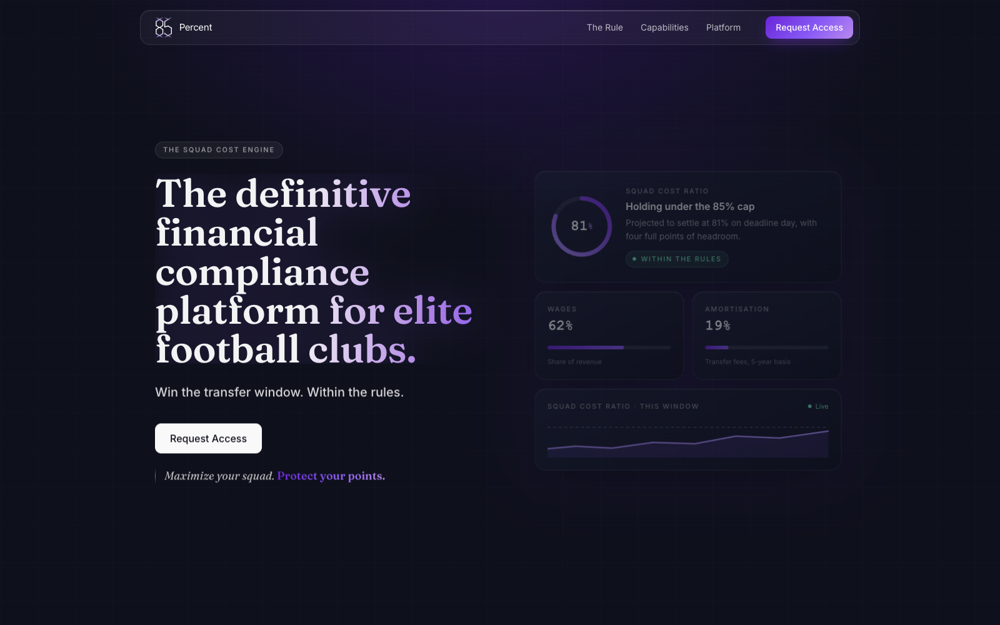
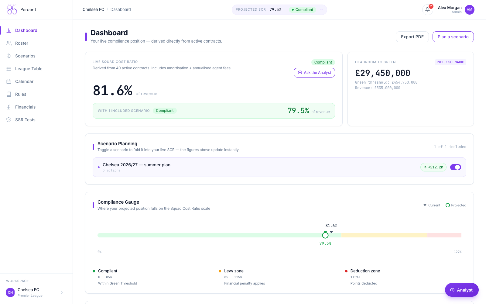
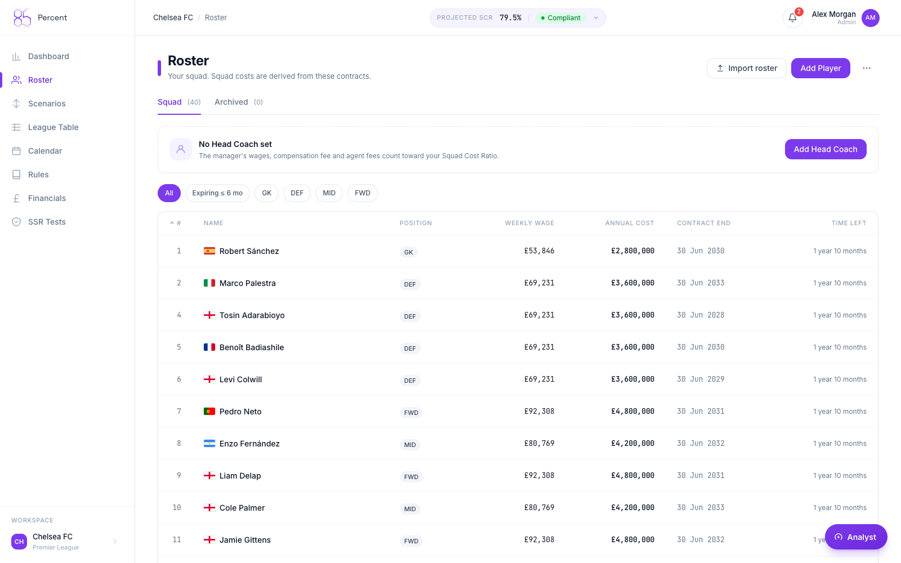
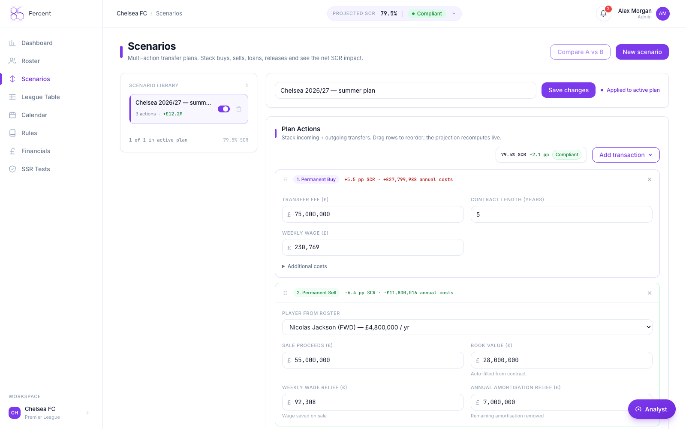
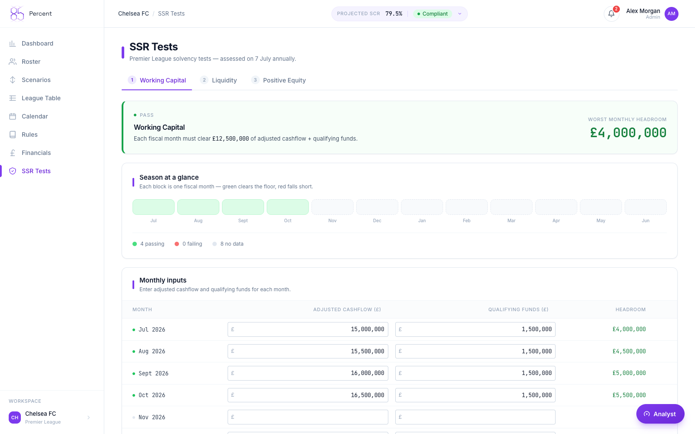
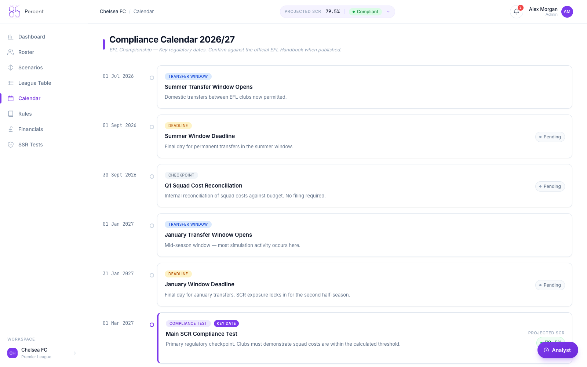
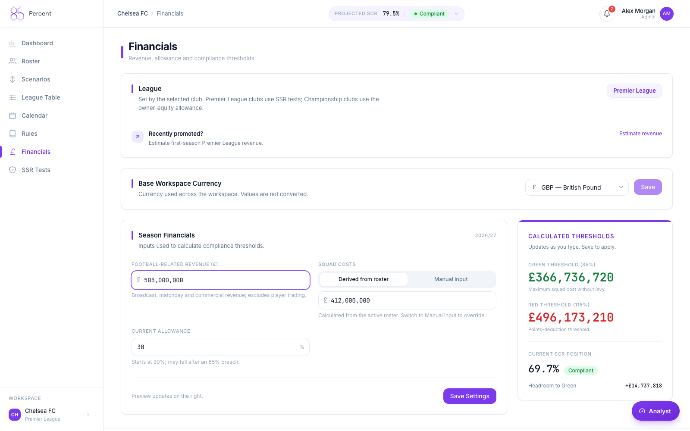
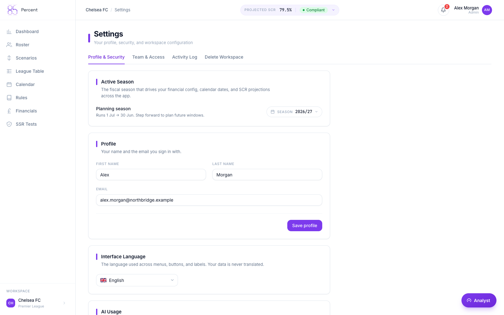
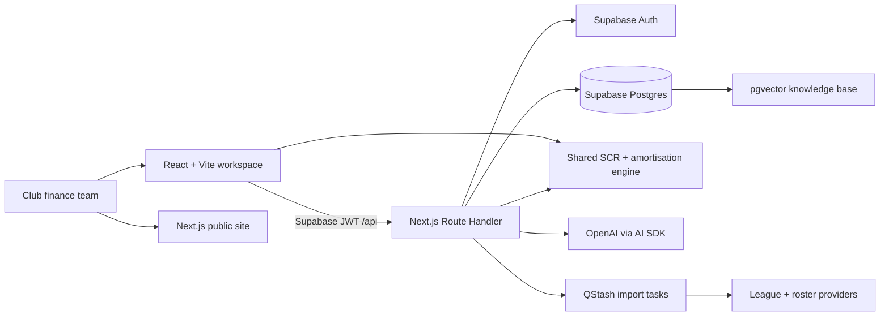
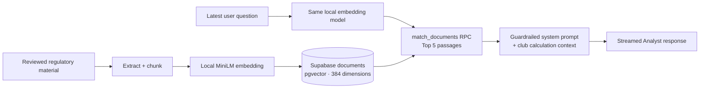

# 85Percent

**A financial-compliance workspace for professional football clubs.** 85Percent turns contract, roster, transfer, and financial data into a clear view of Squad Cost Ratio (SCR) exposure before a club commits to a decision.

`TypeScript` `React` `Next.js` `Supabase` `Postgres / pgvector` `Turborepo`



> **Portfolio note:** the product captures below use the local Chelsea template roster, which contains real player names. Financial inputs, contract values, transfer fees, and scenarios are illustrative product data—not Chelsea FC financial statements or recommendations.

## Why it exists

Football finance teams need to connect decisions that are usually kept in separate spreadsheets: player contracts, transfer accounting, football revenue, league rules, and the evidence behind a conclusion. 85Percent provides that shared operating view.

The platform calculates SCR deterministically, surfaces the regulatory consequence of a result, and lets a club model a summer plan before it becomes a budget commitment. An embedded Analyst can explain the saved context and supporting regulatory material, but never substitutes its own arithmetic for the calculation engine.

## Product tour

### Executive dashboard



Live SCR, risk band, the active squad-cost position, and the expected effect of the selected plan are visible together.

### Full club roster and contracts



The roster combines player, contract, salary, expiry, and accounting context in one searchable workspace. The capture shows the full 40-player Chelsea template roster.

### Transfer scenario builder



Finance teams can build a realistic plan from purchases, sales, loans, extensions, and salary changes, then compare its regulatory impact against the current baseline.

### Premier League SSR



Separate assessments make the Working Capital, Liquidity, and Positive Equity tests visible rather than treating SCR as the only financial constraint.

### Contract calendar



An operational calendar brings renewals, reporting obligations, and material decision dates into the same workflow.

### Financial inputs and regulatory thresholds



The financial model makes the revenue inputs, squad costs, green threshold, allowance, and red threshold inspectable.

### Workspace controls



Team invitations, granular permissions, TOTP, audit history, currencies, notifications, and workspace settings support the finance team around the model.

## What the product covers

- **SCR and consequences:** squad cost calculation, green/amber/red status, levy exposure, and points-deduction logic.
- **Roster accounting:** players, managers, contracts, extensions, wages, amortisation, and expiry tracking. Player amortisation is capped at five years for SCR purposes.
- **Scenario planning:** saved scenario actions are layered over the active baseline, so transfer plans can be compared before approval.
- **SSR:** Working Capital, Liquidity, and Positive Equity assessments for Premier League Sustainability and Systemic Resilience requirements.
- **Operational workflow:** onboarding, season selection, contract calendar, regulatory rules, league table, notifications, and export-ready evidence.
- **Collaboration and governance:** workspace roles, invitations, TOTP, and audit history.
- **Context-aware Analyst:** an AI copilot that explains the club’s calculated position and retrieves supporting regulatory context.

## Rules the calculation engine enforces

The shared `@85percent/engine` package keeps the financial logic outside the UI and AI layer.

| Rule                  | Implementation                                                             |
| --------------------- | -------------------------------------------------------------------------- |
| Green SCR threshold   | 85%                                                                        |
| Red threshold         | `85% + allowance percentage points`—not `85% × allowance`                  |
| Default red threshold | 115% with the default 30-point allowance                                   |
| Red consequence       | Six points, plus one point for each complete £6.5m above the red threshold |
| Included costs        | Player **and manager/head-coach** costs                                    |
| Amortisation          | Capped at five years for SCR                                               |
| Championship support  | Optional owner-equity top-up                                               |

All monetary database values are stored as integer pence. The engine and server-side helpers own arithmetic; presentation and AI layers consume the resulting figures.

## Architecture



This pnpm 11 + Turborepo monorepo contains three deployable apps:

| Area                | Responsibility                                             | Local port |
| ------------------- | ---------------------------------------------------------- | ---------- |
| `apps/web`          | React 18 + Vite product workspace                          | 5173       |
| `apps/admin`        | Next.js 14 admin console and serverless API                | 4000       |
| `apps/landing-page` | Next.js 14 marketing and demo-request site                 | 3100       |
| `packages/engine`   | Pure SCR, amortisation, consequence, and SSR calculations  | —          |
| `packages/shared`   | Shared types, Zod schemas, money helpers, and chat context | —          |
| `packages/brand`    | Shared marks and wordmark assets                           | —          |

The serverless API preserves 72 method/path contracts through a dispatcher beneath `apps/admin/app/api/[...path]/route.ts`. Supabase service-role access bypasses RLS, so tenant-owned queries are explicitly scoped by `club_id` and, where relevant, `user_id`.

## Analyst: grounded, explainable assistance

The Analyst is deliberately an explanation layer—not a calculation authority.

- **Model:** OpenAI through the Vercel AI SDK; `gpt-5.6-luna` is the default and `OPENAI_MODEL` provides an intentional server-side override.
- **Retrieval:** `Xenova/all-MiniLM-L6-v2` creates local 384-dimensional embeddings; pgvector returns up to five relevant knowledge-base passages per query.
- **Guardrails:** the prompt receives deterministic SCR/roster/scenario context, tells the model to explain rather than recompute, and asks it to identify when official regulatory validation is required.
- **Experience:** responses stream to the client; user-scoped history is persisted and compacted to preserve useful context.
- **Cost control:** the current internal billing constants are $1.00 / 1M input tokens and $6.00 / 1M output tokens with a 10% margin. These are configuration values, not a latency or quality benchmark.

### RAG pipeline

The retrieval layer is intentionally provider-independent: it can keep the inference model focused on language while the application owns its source material and vector search.



- **Safe ingestion:** the ingestion script extracts and chunks a reviewed source, embeds every passage before it replaces that source's rows, and aborts rather than clearing the knowledge base when extraction produces no usable chunks.
- **Comparable vectors:** ingestion and query-time retrieval use the same mean-pooled, L2-normalised `all-MiniLM-L6-v2` vector representation, keeping semantic search in a single 384-dimensional space with no embedding API key or per-query embedding fee.
- **Context assembly:** the API embeds the latest user turn, invokes `match_documents`, and places the five best passages alongside the relevant Dashboard, Roster, or Scenario context in the system prompt.
- **Bounded responsibility:** passages give the model regulatory language to explain; the shared engine remains the authority for SCR, amortisation, thresholds, and scenario outcomes. If retrieval is unavailable, the event is logged and the prompt explicitly records that no relevant passages were retrieved.

There is no published LLM quality benchmark yet. The current validation emphasis is on deterministic engine tests, serverless route-contract tests, pricing tests, and human review of regulatory sources. A representative, reviewed football-finance question set is the next requirement before making model-quality claims.

## Run locally

Prerequisites: Node.js 20+, pnpm (the repository pins pnpm 11.2.2), and a Supabase project. Upstash is required for production rate limiting; local API limiting is skipped when its variables are absent.

```bash
pnpm install --frozen-lockfile

cp apps/web/.env.example apps/web/.env.local
cp apps/admin/.env.example apps/admin/.env.local
cp apps/landing-page/.env.example apps/landing-page/.env.local

pnpm dev
```

Fill only the values required for the surfaces you intend to run. Environment files are ignored by Git; never commit a service-role key, database URL, password, signing secret, or provider token.

The main variables are intentionally documented in the tracked examples:

| Surface   | Required configuration groups                                                                                         |
| --------- | --------------------------------------------------------------------------------------------------------------------- |
| Web       | Supabase URL and browser-safe anon/publishable key                                                                    |
| Admin/API | Supabase service-role + anon keys, admin session values, `OPENAI_API_KEY`, optional rate-limit/import provider values |
| Landing   | browser-safe Supabase values and optional PostHog / Upstash lead-form values                                          |

Local URLs: web `http://localhost:5173`, admin/API `http://localhost:4000`, landing `http://localhost:3100`, and API health `http://localhost:4000/api/health`.

Run these checks as separate invocations:

```bash
pnpm typecheck
pnpm test
pnpm build
```

For database-backed template onboarding validation, use `pnpm --filter @85percent/admin test:onboarding` against a deliberately configured environment.

## Data, imports, and migrations

- The Prisma schema and normal development migrations live in `apps/admin/prisma`.
- `supabase/migrations` holds the aggregate Supabase bootstrap/security history. Do not apply both histories to the same provisioned database without following the intended workflow.
- Manual roster sync creates durable tasks per club or league, allowing independent progress, retry, review, and cancellation. External provider data may update public roster fields only; accounting assumptions remain club-owned.

See [the financial model](docs/financial-model.md), [database workflow](docs/database-workflow.md), and [data-import runbook](docs/data-import-sync.md).

## Deliberate limitations

- Regulatory content and AI answers are decision support, not legal or regulatory advice; source material must be validated before it is treated as authoritative.
- Several roster and scenario mutations use compensating rollbacks instead of database transactions.
- AI balance deduction occurs after a streamed response, so a failure at that boundary can leave provider usage unbilled.
- The manual Transfermarkt adapter is unofficial and operationally fragile; it should be monitored and retried per task, not as a bulk blind refresh.
- There is no application-level browser E2E suite yet.

## License

MIT © 2026 asset8k. See [LICENSE](LICENSE).
